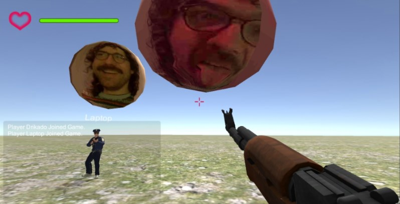

# Unity conference

## About this project

A unity project in which you can walk around with an avatar that displays your webcam stream.

By far not in the state I would like it to be. Start or build the game with Unity and press 'E' when in the game to make a webcam snapshot and set it as the main texture of the avatar sphere floating above your head.

Inspired by [Multiplayer-FPS](https://github.com/Armour/Multiplayer-FPS)

_Screenshot of me video-conferencing with myself on another machine._
